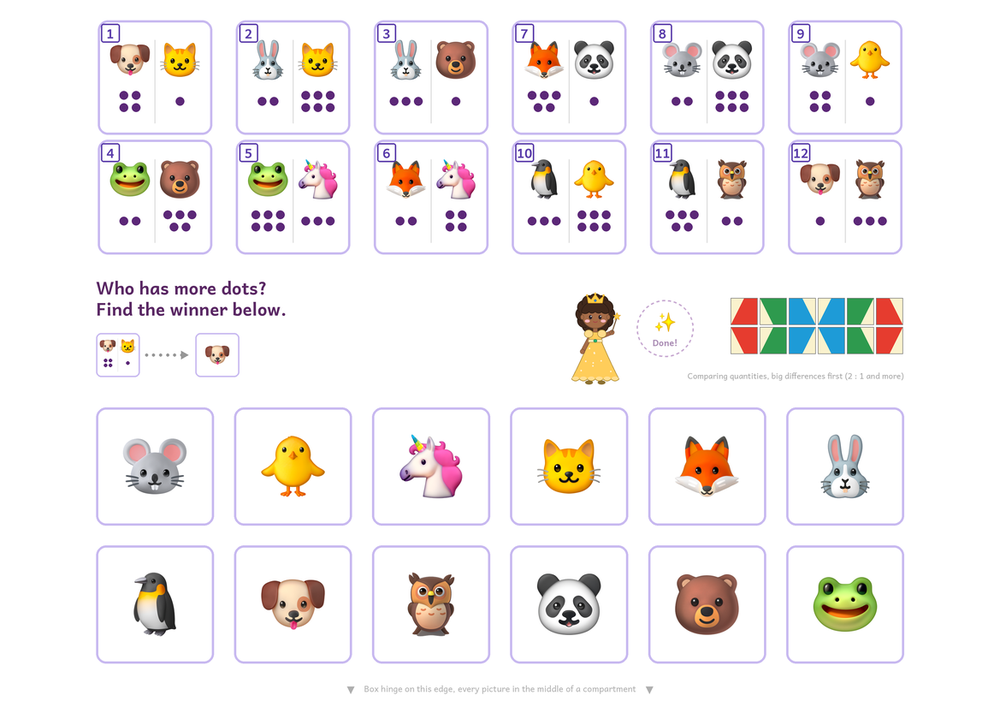
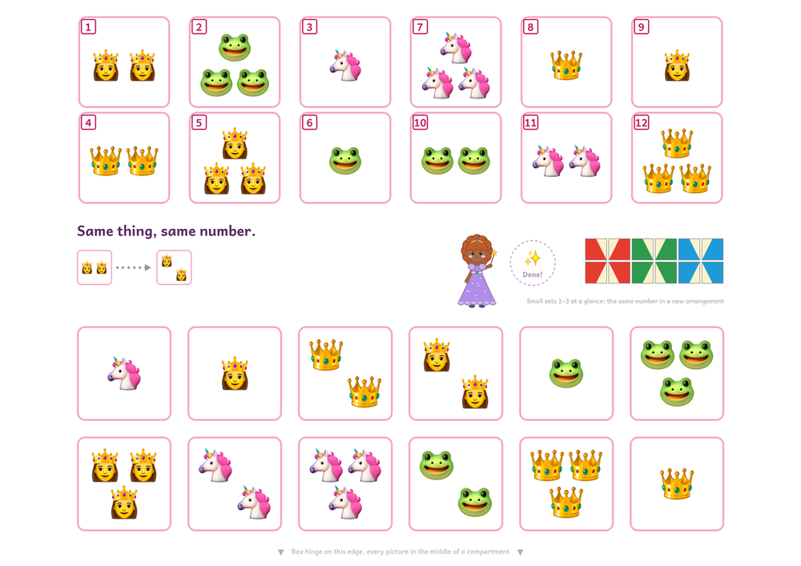
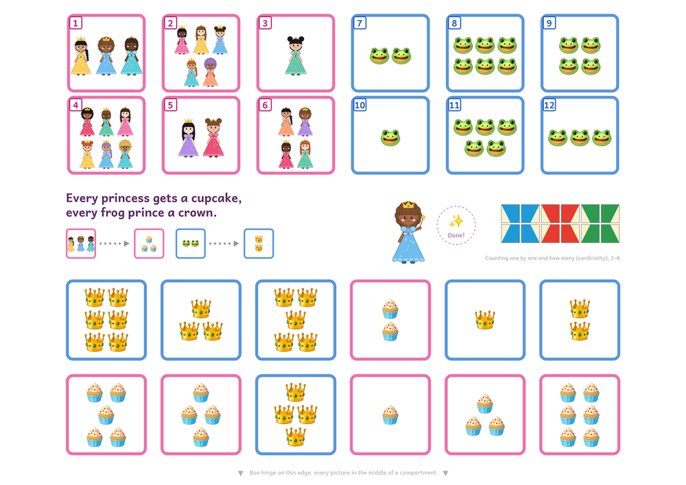
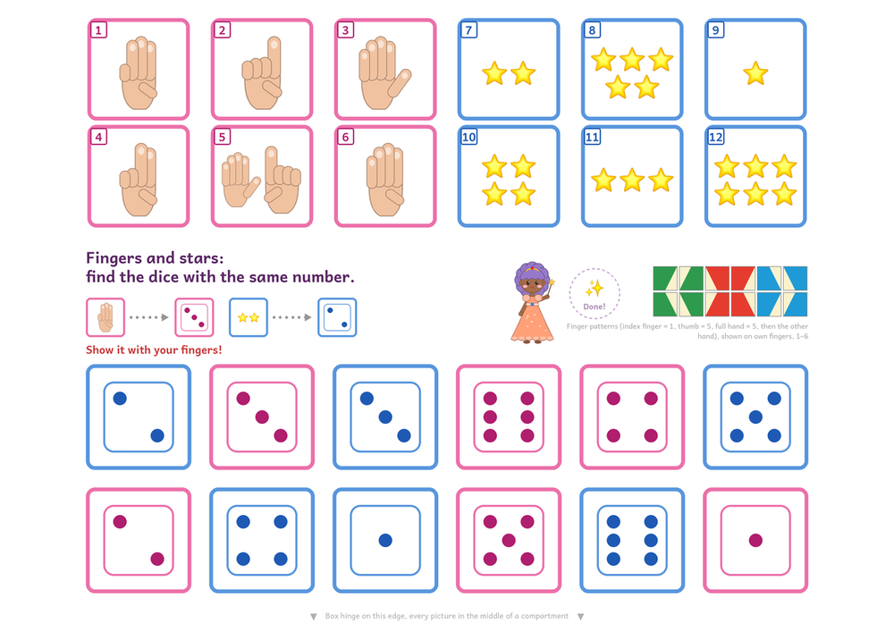
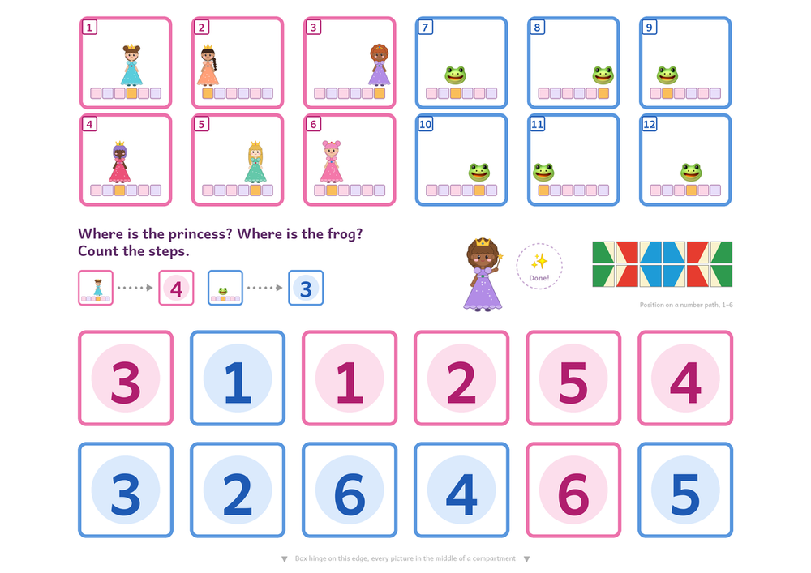

# miniluek-sheets

Printable A4 worksheets for the **miniLÜK** control box, with control patterns that work.
An agent skill and a small Python generator: write 12 tasks per sheet as JSON, get a PDF.

The flagship is the counting course: 13 sheets ordered along the early-math progression of the
What Works Clearinghouse practice guide, every order step, sheet and rule mapped to its study
([research](miniluek-sheets/presets/counting_and_numbers/research.md)). A smaller, experimental reading course, `Reading readiness (ABC)` in
`presets/reading/reading-readiness.json` (German: `Lese-Vorbereitung (ABC)` in
`presets/reading/lese-vorbereitung.json`), ships as a clearly-marked second course below.



Ready to print: [English counting PDF](https://github.com/micuintus/miniluek-sheets/releases/latest/download/princess-counting-en.pdf) ·
[deutsches Zählen-PDF](https://github.com/micuintus/miniluek-sheets/releases/latest/download/prinzessinnen-zaehlen-de.pdf) ·
[English reading PDF](https://github.com/micuintus/miniluek-sheets/releases/latest/download/reading-readiness-en.pdf) ·
[deutsches Lese-PDF](https://github.com/micuintus/miniluek-sheets/releases/latest/download/lese-vorbereitung-de.pdf) (experimentell)

The preset is a thirteen-sheet princess counting course in English, ordered along the early-math
progression of the What Works Clearinghouse practice guide: small sets 1–3, counting to 6, dice
and finger patterns, comparing, numerals both ways, scattered sets, a number path, comparing by
counting and comparing numbers, then ten-frame and "one more". Each sheet runs one direction,
and matching sheets use two colour families, so no answer is a copy of a task. All counting docs sit with the presets in `presets/counting_and_numbers/`, all reading docs
in `presets/reading/`; `references/` keeps only the generator docs (`spec.md`, `format.md`).

The German version
(`presets/counting_and_numbers/prinzessinnen-zaehlen.json`) has the same sheets; its finger pictures count from the
thumb, the English ones from the index finger (`--fingers` switches).

| | |
|---|---|
|  |  |
|  |  |

## Second course: reading readiness

ABC sheets for letters, first sounds, syllables and short printed words, in English
(`presets/reading/reading-readiness.json`) and German
(`presets/reading/lese-vorbereitung.json`). Same generator, same design rules (one direction,
two colour families, no copies among answers, `check` enforces them). Order is in
[`presets/reading/teaching-order.md`](miniluek-sheets/presets/reading/teaching-order.md);
evidence in [`presets/reading/research.md`](miniluek-sheets/presets/reading/research.md).

The counting course is the one with the research behind it. The reading course borrows the
literacy-precursor evidence without the same tight mapping, and no study has tested letter
sheets in this form or two letter systems at once. Keep counting daily and reading twice a
week until the counting sheets are mastered.

## Install

**Pi:**
```bash
pi install git:github.com/micuintus/miniluek-sheets
```

**Other agents:** copy the `miniluek-sheets/` directory into your agent's skills folder. It
needs Python 3.9+ and Pillow (`pip install pillow`).

## Use

```bash
cd miniluek-sheets
python3 scripts/miniluek.py build presets/counting_and_numbers/princess-counting.json -o princess-counting.pdf
python3 scripts/miniluek.py build presets/counting_and_numbers/prinzessinnen-zaehlen.json -o prinzessinnen-zaehlen.pdf
python3 scripts/miniluek.py build presets/reading/reading-readiness.json -o reading-readiness.pdf
python3 scripts/miniluek.py build presets/reading/lese-vorbereitung.json -o lese-vorbereitung.pdf
python3 scripts/miniluek.py fit-test -o fit.pdf
```

Print landscape at **100 % / actual size**. Open the box and lay the clear lid on the sheet with
the hinge on the lower paper edge: every picture sits in one compartment. Tile 1 goes on the
answer to task 1, and so on. Close, turn over, open, compare with the printed pattern.

Or ask your agent: "make miniLÜK sheets: dice and numbers 1–6, with unicorns".

## Your own sets

Copy the preset, edit titles and tasks, then `python3 scripts/miniluek.py check your-set.json`.
Matching (one or two colour families), "one more", same-thing and comparing sheets (dots or
numerals) are supported; pictures include drawn
princesses, finger patterns, dice, numerals, a ten-frame, a number path and 33 emoji.
Format: [spec](miniluek-sheets/references/spec.md) (shared by both courses).

## How it works

- Geometry: compartment pitch 4.10 cm, measured and checked on a real box.
- Control patterns: the twelve tile backs (three colours, a cream triangle in one of four
  corners) were mapped from published example exercises and checked on the box. Every pattern
  in the library uses each tile once and is symmetric. Details: [format](miniluek-sheets/references/format.md).
- Counting order and sources: [teaching order](miniluek-sheets/presets/counting_and_numbers/teaching-order.md).
- Every counting choice mapped to its study: [research](miniluek-sheets/presets/counting_and_numbers/research.md).

## Credits and licences

Code and the drawn princesses and hands: MIT ([LICENSE](LICENSE)). Emoji: Noto Emoji by Google,
SIL Open Font License 1.1. Font: Andika by SIL International, SIL Open Font License 1.1.
Sources and licence texts: [NOTICE](NOTICE.md).

Not affiliated with Westermann. miniLÜK and LÜK are trademarks of Westermann; the box and the
original booklets are sold by them.
